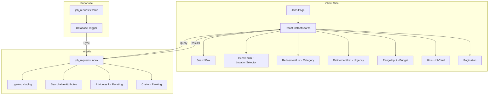

# Algolia Search Implementation Plan

## Overview

Replace the current Supabase full-text search with Algolia for production-ready search functionality, including proximity ranking based on user location.

## Design System Requirements

**CRITICAL:** All UI components must strictly follow the design system defined in `DESIGN.md`.

### Key Design Principles

- **Glassmorphism**: Use `bg-surface-glass!` and `backdrop-blur-glass!` for elevated surfaces
- **Colors**: Primary (Navy #15196c), Secondary (Orange #a53b15) for CTAs
- **Typography**: Manrope for headings, Inter for body text
- **Rounded**: `rounded-full!` for pill shapes (search bar, buttons)
- **Shadows**: Soft, high-diffusion shadows with primary color tint

### Tailwind + Ant Design Pattern

When applying Tailwind classes to Ant Design components, **always use the `!` important notation**:

```tsx
<Button className="rounded-full! px-8! bg-primary!" />
```

### Search Bar Design Reference

The new Algolia search bar must match the existing [`JobSearchBar.tsx`](components/ui/jobs/JobSearchBar.tsx) design:

- Glassmorphic container with `bg-surface-glass! backdrop-blur-glass!`
- Pill shape with `rounded-full!`
- White border with `border border-white/20!`
- Search icon + input + divider + budget dropdown + CTA button
- CTA button uses `bg-primary!` (Navy) with `rounded-full!`

## Current State

- **Search**: Supabase `textSearch` with `search_vector` (basic full-text search)
- **Location**: `job_requests` table has `coordinates` (JSONB) and `location` (geography) columns
- **Filters**: Category, location (state), urgency, budget - all server-side
- **Pagination**: Server-side with Supabase range queries

## Target State

- **Search**: Algolia instant search with typo-tolerance, faceting, and relevance ranking
- **Location**: Proximity ranking using `_geoloc` field with GPS + manual location selection
- **Filters**: Client-side faceted filtering with instant updates
- **Pagination**: Client-side with Algolia hits per page

---

## Architecture



---

## Implementation Steps

### Phase 1: Environment & Dependencies

#### 1.1 Install Algolia Packages

```bash
npm install algoliasearch react-instantsearch instantsearch.js
```

#### 1.2 Environment Variables

Add to `.env.local`:

```env
# Algolia
NEXT_PUBLIC_ALGOLIA_APP_ID=your_app_id
NEXT_PUBLIC_ALGOLIA_SEARCH_KEY=your_search_only_api_key
ALGOLIA_ADMIN_KEY=your_admin_api_key  # For reindexing scripts only
```

---

### Phase 2: Algolia Index Configuration

#### 2.1 Index Settings

Configure the `job_requests` index in Algolia Dashboard or via API:

```javascript
{
  // Searchable attributes (ordered by importance)
  searchableAttributes: [
    'title',
    'subcategory',
    'description',
    'category'
  ],

  // Attributes for faceting (filters)
  attributesForFaceting: [
    'searchable(category)',
    'searchable(subcategory)',
    'searchable(urgency)',
    'searchable(state)',
    'searchable(lga_name)',
    'budget',
    'status'
  ],

  // Attributes to display in results
  attributesToRetrieve: [
    'id',
    'title',
    'description',
    'category',
    'subcategory',
    'budget',
    'urgency',
    'photo_urls',
    'state',
    'city',
    'lga_name',
    'created_at',
    'expires_at',
    'customer_id',
    '_geoloc',
    'quote_count',
    'viewed_count'
  ],

  // Ranking formula
  ranking: [
    'geo',           // Proximity ranking (distance)
    'typo',          // Typo tolerance
    'words',         // Number of matched words
    'filters',       // Filter match
    'proximity',     // Word proximity
    'attribute',     // Attribute importance
    'exact',         // Exact match
    'custom'         // Custom ranking
  ],

  // Custom ranking (when all else is equal)
  customRanking: [
    'desc(created_at)',    // Newer jobs first
    'desc(quote_count)'    // Popular jobs first
  ],

  // Geo search settings
  aroundLatLngViaIP: false,  // We'll provide coordinates manually
  aroundRadius: 'all',       // No default radius limit

  // Pagination
  hitsPerPage: 12,
  paginationLimitedTo: 1000
}
```

#### 2.2 Data Transformation for \_geoloc

The Supabase integration needs to transform `coordinates` JSONB to Algolia's `_geoloc` format:

**Source (Supabase):**

```json
{
  "coordinates": { "lat": 6.5244, "lng": 3.3792 }
}
```

**Target (Algolia):**

```json
{
  "_geoloc": { "lat": 6.5244, "lng": 3.3792 }
}
```

**Note:** Configure this transformation in Algolia's Supabase integration settings.

---

### Phase 3: Frontend Implementation

#### 3.1 Create Algolia Client Service

**File:** `services/algolia/client.ts`

```typescript
import algoliasearch from "algoliasearch/lite";

export const searchClient = algoliasearch(
  process.env.NEXT_PUBLIC_ALGOLIA_APP_ID!,
  process.env.NEXT_PUBLIC_ALGOLIA_SEARCH_KEY!
);

export const ALGOLIA_INDICES = {
  JOBS: "job_requests",
} as const;
```

#### 3.2 Create Geolocation Hook

**File:** `hooks/useGeolocation.ts`

```typescript
"use client";

import { useState, useEffect } from "react";

interface GeoPosition {
  lat: number;
  lng: number;
}

export function useGeolocation() {
  const [location, setLocation] = useState<GeoPosition | null>(null);
  const [error, setError] = useState<string | null>(null);
  const [loading, setLoading] = useState(true);

  useEffect(() => {
    if (!navigator.geolocation) {
      setError("Geolocation not supported");
      setLoading(false);
      return;
    }

    navigator.geolocation.getCurrentPosition(
      (position) => {
        setLocation({
          lat: position.coords.latitude,
          lng: position.coords.longitude,
        });
        setLoading(false);
      },
      (err) => {
        setError(err.message);
        setLoading(false);
      },
      { enableHighAccuracy: true, timeout: 5000 }
    );
  }, []);

  return { location, error, loading };
}
```

#### 3.3 Create Location Selector Component

**File:** `components/ui/jobs/AlgoliaLocationFilter.tsx`

Features:

- Toggle between "Use my location" and "Select location"
- Manual location input (state/LGA dropdown)
- Radius selector (5km, 10km, 25km, 50km, Any)
- Display current location status

#### 3.4 Create Main Search Component

**File:** `components/ui/jobs/AlgoliaJobSearch.tsx`

```typescript
'use client';

import { InstantSearch, Configure } from 'react-instantsearch';
import { searchClient, ALGOLIA_INDICES } from '@/services/algolia/client';
import { SearchBox } from './SearchBox';
import { JobHits } from './JobHits';
import { JobFilters } from './JobFilters';
import { Pagination } from './Pagination';
import { useGeolocation } from '@/hooks/useGeolocation';

export function AlgoliaJobSearch() {
  const { location } = useGeolocation();

  return (
    <InstantSearch searchClient={searchClient} indexName={ALGOLIA_INDICES.JOBS}>
      <Configure
        hitsPerPage={12}
        aroundLatLng={location ? `${location.lat}, ${location.lng}` : undefined}
        aroundRadius="all"
      />

      <div className="flex gap-6">
        <aside className="w-[280px]">
          <JobFilters />
        </aside>

        <div className="flex-1">
          <SearchBox />
          <JobHits />
          <Pagination />
        </div>
      </div>
    </InstantSearch>
  );
}
```

#### 3.5 Create Sub-Components

| Component            | File                                                | Purpose                                |
| -------------------- | --------------------------------------------------- | -------------------------------------- |
| `SearchBox`          | `components/ui/jobs/algolia/SearchBox.tsx`          | Search input with autocomplete         |
| `JobHits`            | `components/ui/jobs/algolia/JobHits.tsx`            | Display job results                    |
| `JobHit`             | `components/ui/jobs/algolia/JobHit.tsx`             | Single job card                        |
| `CategoryFilter`     | `components/ui/jobs/algolia/CategoryFilter.tsx`     | Category refinement list               |
| `UrgencyFilter`      | `components/ui/jobs/algolia/UrgencyFilter.tsx`      | Urgency refinement list                |
| `BudgetFilter`       | `components/ui/jobs/algolia/BudgetFilter.tsx`       | Budget range filter                    |
| `LocationFilter`     | `components/ui/jobs/algolia/LocationFilter.tsx`     | Location + radius filter               |
| `Pagination`         | `components/ui/jobs/algolia/Pagination.tsx`         | Algolia pagination                     |
| `CurrentRefinements` | `components/ui/jobs/algolia/CurrentRefinements.tsx` | Active filters display                 |
| `ClearFilters`       | `components/ui/jobs/algolia/ClearFilters.tsx`       | Clear all filters button               |
| `SortBy`             | `components/ui/jobs/algolia/SortBy.tsx`             | Sort options (relevance, newest, etc.) |
| `Stats`              | `components/ui/jobs/algolia/Stats.tsx`              | Result count and search time           |

#### 3.6 SearchBox Component Design Specification

The `SearchBox` component must match the existing [`JobSearchBar.tsx`](components/ui/jobs/JobSearchBar.tsx) design exactly:

**Container Structure:**

```tsx
<div className="bg-surface-glass! backdrop-blur-glass! p-2! rounded-full! shadow-[var(--shadow-level-1)]! border border-white/20! flex flex-wrap md:flex-nowrap items-center gap-2">
```

**Internal Layout:**

1. **Search Input Area** (left section)
   - Icon: `SearchOutlined` from `@ant-design/icons` with `text-outline text-[18px]`
   - Input: Native `<input>` with `bg-transparent border-none focus:ring-0 focus:outline-none text-on-surface placeholder:text-outline/60 font-inter text-[16px]`
   - Container: `flex-1 flex items-center gap-3 px-6 py-2`

2. **Vertical Divider** (middle)
   - `h-8 w-[1px] bg-outline-variant/30 hidden md:block`

3. **Budget Dropdown** (right section)
   - Icon: `WalletOutlined` with `text-outline text-[20px]`
   - Select: Native `<select>` with `bg-transparent border-none focus:ring-0 focus:outline-none font-inter text-[14px] font-medium text-on-surface-variant cursor-pointer appearance-none`
   - Container: `flex items-center gap-2 px-4 py-2`

4. **CTA Button** (far right)
   - Ant Design `Button` with `type="primary"`
   - Classes: `rounded-full! px-8! h-auto! py-3! font-inter! text-[14px]! font-medium! shadow-md! hover:opacity-90! bg-primary!`
   - Text: "Find Jobs"

**Key Design Tokens:**

- Background: `bg-surface-glass!` (rgba(255, 255, 255, 0.7))
- Backdrop blur: `backdrop-blur-glass!`
- Border radius: `rounded-full!` (pill shape)
- Border: `border border-white/20!`
- Shadow: `shadow-[var(--shadow-level-1)]!`
- Primary color: `bg-primary!` (#15196c - Deep Navy)

**Integration with Algolia:**

- Replace native `<input>` with Algolia's `<SearchBox>` widget
- Wrap the entire component in `<InstantSearch>` provider
- Use `useSearchBox()` hook to connect custom input to Algolia
- Budget dropdown becomes a `<MenuSelect>` or custom refinement widget

---

### Phase 4: Integration with Existing Code

#### 4.1 Update Jobs Page

**File:** `app/(dashboard)/dashboard/jobs/page.tsx`

Replace server-side data fetching with client-side Algolia search:

```typescript
// Before: Server component with fetchJobs()
// After: Client component with Algolia InstantSearch

import { AlgoliaJobSearch } from '@/components/ui/jobs/AlgoliaJobSearch';

export default function JobsPage() {
  return (
    <main className="...">
      <AlgoliaJobSearch />
    </main>
  );
}
```

#### 4.2 Preserve Existing JobCard Component

Reuse `JobCardWithCredits` by adapting it to receive Algolia hit data:

```typescript
// components/ui/jobs/algolia/JobHit.tsx
import { Hit } from 'instantsearch.js';
import JobCardWithCredits from '../JobCardWithCredits';

interface JobHitProps {
  hit: Hit<JobRecord>;
}

export function JobHit({ hit }: JobHitProps) {
  // Transform Algolia hit to JobListing format
  const job = transformHitToJob(hit);
  return <JobCardWithCredits job={job} />;
}
```

---

### Phase 5: Advanced Features

#### 5.1 Sort Options (Virtual Indices)

Create virtual indices for different sorting:

| Index                       | Purpose                         |
| --------------------------- | ------------------------------- |
| `job_requests`              | Default (relevance + proximity) |
| `job_requests_created_desc` | Newest first                    |
| `job_requests_budget_asc`   | Budget: Low to High             |
| `job_requests_budget_desc`  | Budget: High to Low             |

#### 5.2 Search Analytics (Optional)

Enable Algolia Insights for tracking:

- Click-through rate
- Conversion rate
- Zero-results searches

#### 5.3 Query Rules (Optional)

Set up query rules in Algolia Dashboard for:

- Synonyms (e.g., "plumber" = "pipe fitter")
- Boosting (e.g., verified artisans get higher ranking)
- Redirects (e.g., "urgent jobs" → filter by urgency)

---

## Migration Strategy

### Step 1: Parallel Implementation

- Keep existing Supabase search working
- Build Algolia components alongside
- Test with a feature flag

### Step 2: Data Validation

- Verify all job_records are synced to Algolia
- Compare search results between Supabase and Algolia
- Validate geo-search accuracy

### Step 3: Cutover

- Switch jobs page to use Algolia
- Monitor search analytics
- Keep Supabase search as fallback

### Step 4: Cleanup

- Remove old search components
- Update documentation

---

## File Structure

```
services/
  algolia/
    client.ts              # Algolia search client

hooks/
  useGeolocation.ts        # GPS location hook

components/ui/jobs/
  AlgoliaJobSearch.tsx     # Main search wrapper
  algolia/
    SearchBox.tsx
    JobHits.tsx
    JobHit.tsx
    CategoryFilter.tsx
    UrgencyFilter.tsx
    BudgetFilter.tsx
    LocationFilter.tsx
    Pagination.tsx
    CurrentRefinements.tsx
    ClearFilters.tsx
    SortBy.tsx
    Stats.tsx

app/(dashboard)/dashboard/jobs/
  page.tsx                 # Updated to use Algolia
```

---

## Testing Checklist

- [ ] Search returns relevant results for keywords
- [ ] Typo tolerance works (e.g., "plumbr" → "plumber")
- [ ] Proximity ranking works (closer jobs appear first)
- [ ] Location filter with radius works
- [ ] Category filter shows correct counts
- [ ] Urgency filter works
- [ ] Budget filter works
- [ ] Pagination works
- [ ] Sort options work
- [ ] Empty state displays correctly
- [ ] Loading states work
- [ ] Mobile responsive
- [ ] URL sync (optional - for shareable searches)

---

## Dependencies

| Package               | Version | Purpose                      |
| --------------------- | ------- | ---------------------------- |
| `algoliasearch`       | ^4.x    | Algolia API client           |
| `react-instantsearch` | ^7.x    | React components for Algolia |
| `instantsearch.js`    | ^4.x    | Core InstantSearch library   |

---

## Environment Variables Required

```env
NEXT_PUBLIC_ALGOLIA_APP_ID=your_app_id
NEXT_PUBLIC_ALGOLIA_SEARCH_KEY=your_search_only_api_key
```

**Security Note:** Never expose `ALGOLIA_ADMIN_KEY` in client-side code. Use it only in server-side scripts for reindexing.
